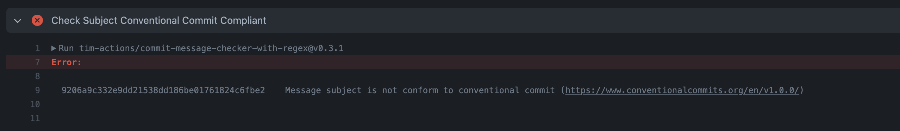
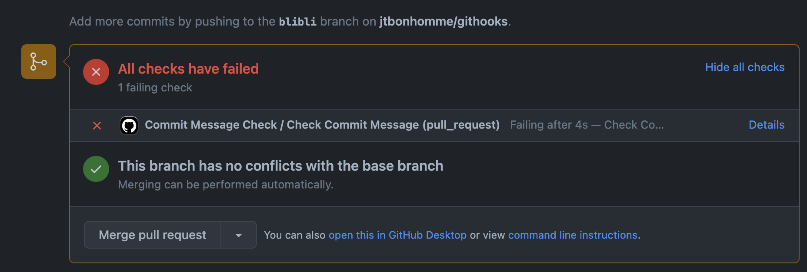

# githooks

[](https://github.com/pre-commit/pre-commit)

My git hooks using [pre-commit.com](https://pre-commit.com)
Note: `main.go` file is only used for demo purposes.

## Install Dependencies

Mac OsX
```sh
brew install gitleaks
brew install pre-commit
brew install golangci-lint
```

## Configure

```sh
$ pre-commit install
pre-commit installed at .git/hooks/pre-commit
```

## Test

### `gitleaks`

```sh
$ gitleaks --path=. -v --no-git -c gitleaks.toml
INFO[0000] scan time: 158 milliseconds 913 microseconds
INFO[0000] No leaks found
```

### `pre-commit`

```sh
$  pre-commit run --all-files                                                        ─╯
[INFO] Initializing environment for https://github.com/pre-commit/pre-commit-hooks.
[INFO] Initializing environment for https://github.com/psf/black.
[INFO] Installing environment for https://github.com/pre-commit/pre-commit-hooks.
[INFO] Once installed this environment will be reused.
[INFO] This may take a few minutes...
[INFO] Installing environment for https://github.com/psf/black.
[INFO] Once installed this environment will be reused.
[INFO] This may take a few minutes...
Check Yaml...........................................(no files to check)Skipped
Fix End of Files.........................................................Passed
Trim Trailing Whitespace.................................................Passed
black................................................(no files to check)Skipped
```

## Commit message check

Installed [Commit Message Checker for pull request github action](https://github.com/marketplace/actions/commit-message-checker-for-pull-request)




## Todo

- [ ] Add github Action: https://github.com/marketplace/actions/semantic-pull-request
